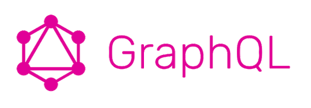

<h1 align="center">
  
</h1>

<h2 align="center">GraphQL with ReactJS</h2>


- Projeto utilizando GraphQL e ReactJS para listar e salvar comentários utilizando Mongoose e ApolloServer / Hooks.
- Utilizando Query para listar os comentários;
- Utilizando Mutation para salvar os comentários;

## :checkered_flag: Startando o projeto

1° Clonar: `git clone https://github.com/leopacciulli/GraphQL-ReactJS.git`

2° Rodar o back end:

```sh
$ cd GraphQL-ReactJS
$ cd graphql-back
$ yarn
$ yarn dev - O projeto irá rodar em: http://localhost:4000/
```

3° Rodar o front end:

```sh
$ cd GraphQL-ReactJS
$ cd graphql-front
$ yarn
$ yarn start
```

---

Autor: [Leonardo Pacciulli](https://www.linkedin.com/in/leonardo-pacciulli-a4b86a92/)